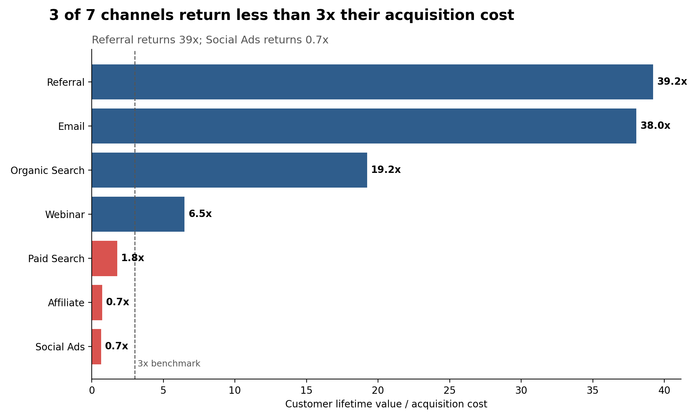
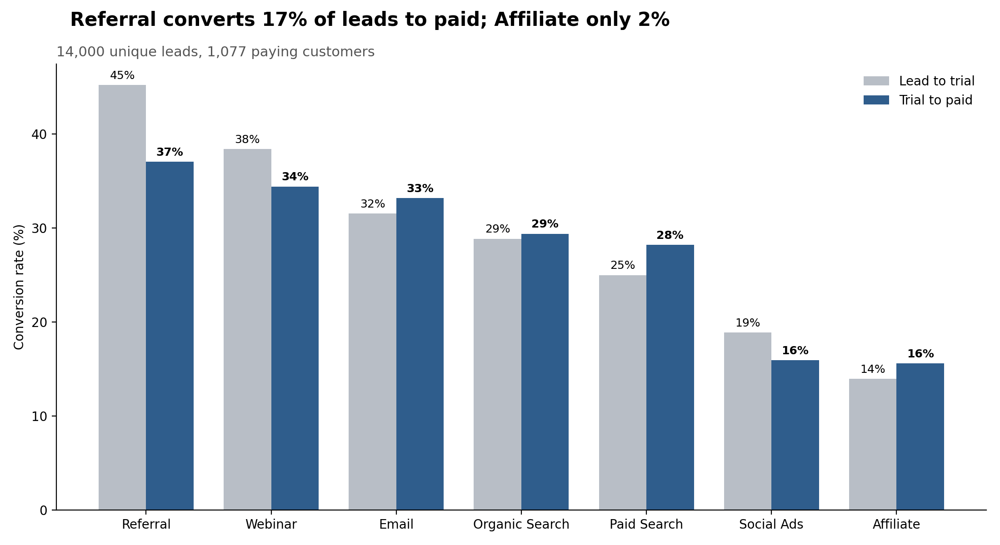
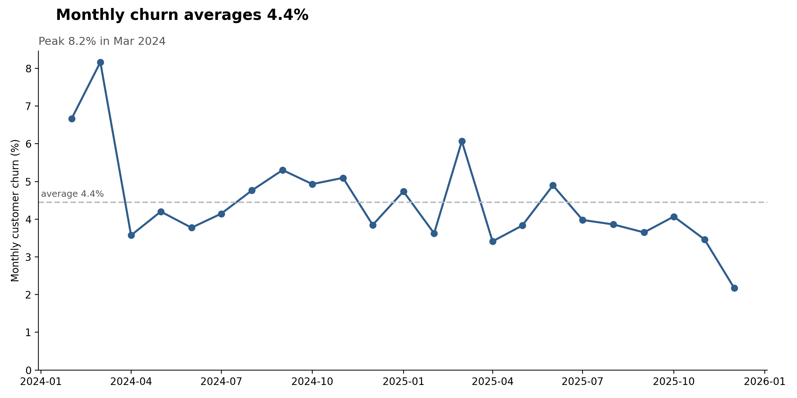
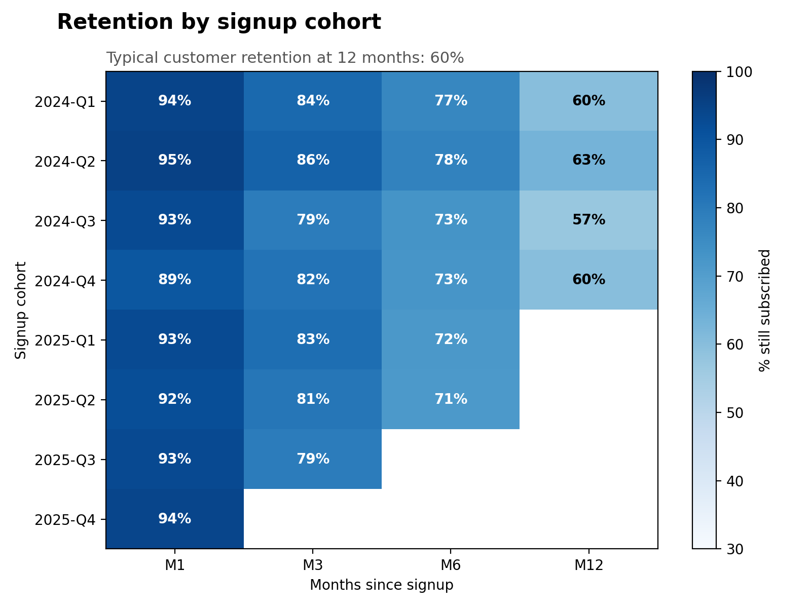
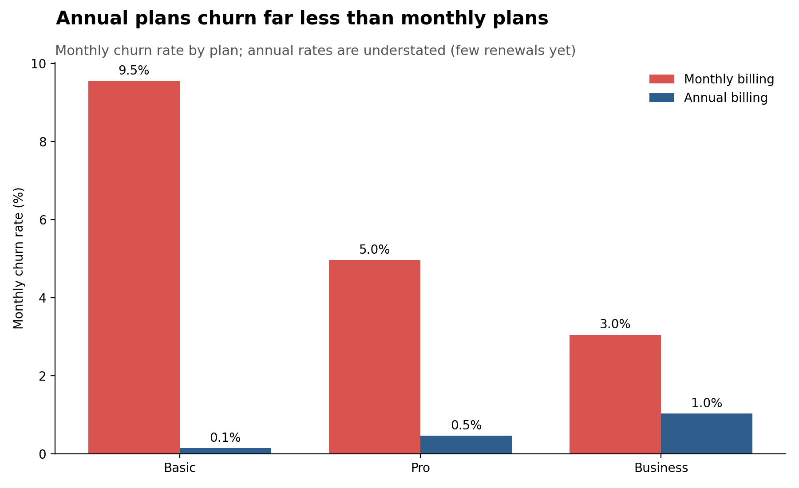

# SaaS Marketing Funnel and Churn Analysis

Which marketing channels bring customers who stay and pay back what they cost to acquire, and where do we lose customers? An end-to-end analysis in **Python, MySQL and SQL window functions**, from data generation to charts.

> **Note on the data:** this is a **simulated dataset** generated by `generate_data.py`. It is not real company data. The findings demonstrate the analytical method, not real-world conclusions.

## Business question

A simulated B2B subscription software company sells monthly and annual plans. People become leads through marketing campaigns, some start a free trial, some become paying customers, and some of those later cancel. The analysis joins the **marketing funnel** to **churn**, because a channel can convert well and still lose money if its customers leave quickly.

## Key findings

**1. Channel quality varies enormously.** Three of seven channels return less than the 3x LTV:CAC rule of thumb: Paid Search (1.8x), Affiliate (0.7x) and Social Ads (0.7x). Webinar returns 6.5x.



**2. Conversion tells the same story.** Referral converts about 17% of leads to paying customers, while Affiliate converts about 2%.



**3. Churn is highest early.** Monthly churn averages 4.4%. Retention falls from about 93% after one month to about 80% after three, and roughly 60% of customers remain after 12 months.





**4. Billing cycle matters.** Monthly plans churn much faster than annual plans at every tier (for example Basic 9.5% vs 0.1% per month). Annual rates are understated, because many annual customers have not yet reached their first renewal.



## Dataset

Four related tables, January 2024 to December 2025 (data cutoff 31 Dec 2025).

| Table | Rows | One row is... |
|---|---|---|
| `campaigns` | 56 | a marketing campaign (7 channels x 8 quarters), with spend |
| `leads` | 14,209 | a person who showed interest, with trial and conversion dates |
| `customers` | 1,077 | a paying subscriber, with plan, MRR and churn date and reason |
| `monthly_activity` | 9,581 | one customer's logins and support tickets in one month |

Relationships: `campaigns` → `leads` → `customers` → `monthly_activity`.

Three data problems were planted on purpose and cleaned in SQL: **209 duplicate leads**, **inconsistent channel spelling** (about 3% of rows), and **missing countries** (about 4%).

## Project structure

```
churn_project/
├── generate_data.py           # builds the simulated dataset (seeded, reproducible)
├── schema.sql                 # creates the database and typed tables
├── load_data.py               # loads the CSVs into MySQL
├── churn_funnel_analysis.sql  # cleaning, staging tables and analysis (Q1-Q11)
├── churn_visuals.py           # builds the charts from the staging tables
├── data/                      # generated CSVs
└── charts/                    # output images
```

## How to run

Requires **MySQL 8.0+** and Python 3.

```bash
pip install numpy pandas matplotlib sqlalchemy pymysql

python generate_data.py     # 1. create the CSVs in ./data
python load_data.py         # 2. create the database and load the data (asks for your MySQL password)
# 3. run churn_funnel_analysis.sql in your SQL client, all statements in one session
python churn_visuals.py     # 4. save the charts to ./charts
```

The generator is seeded, so everyone gets identical data.

## Analysis (SQL)

| # | Question |
|---|---|
| Data checks | Duplicates, spelling variants, missing values |
| Q1 | Funnel conversion by channel (lead to trial to paid) |
| Q2 | Days to convert by channel |
| Q3 | Campaign efficiency, ranked by cost per customer |
| Q4 | Channel economics: CAC, churn, LTV, LTV:CAC, payback months |
| Q5 | Monthly churn trend in customers and MRR |
| Q6 | Churn by plan and billing cycle |
| Q7 | When customers churn (tenure buckets) |
| Q8 | Why customers churn (reasons by plan) |
| Q9 | Cohort retention by signup quarter |
| Q10 | Engagement before churn, churned vs active |
| Q11 | Watchlist of active customers with falling usage, and MRR at risk |

**SQL techniques:** window functions (`ROW_NUMBER`, `RANK`, running and partitioned sums), CTEs including a recursive month spine, `ROLLUP`, conditional aggregation, staging tables, deduplication and data cleaning.

## Metric definitions

- **CAC:** channel spend divided by customers won.
- **Monthly churn rate:** customers lost divided by total customer-months at risk.
- **LTV:** average MRR divided by monthly churn rate.
- **LTV:CAC:** LTV divided by CAC. About 3x or higher is a common healthy benchmark.
- **Payback months:** CAC divided by average MRR.

## Limitations

- **The data is simulated.** Patterns such as referral customers staying longer were built into the generator, so results show the method working, not facts about any real business.
- **CAC only includes campaign spend.** Staff, tooling and overhead are excluded, which inflates LTV:CAC for cheap channels. The very high ratios for Referral and Email should not be read as realistic benchmarks.
- **Annual churn is understated.** Annual customers can only churn at renewal, and many have not reached one by the cutoff.
- **Early months are noisy.** The customer base is small at the start, so the March 2024 churn spike reflects few customers.
- **LTV assumes constant churn.** Real churn changes with tenure, as the early-life drop-off shows.

## Skills demonstrated

SQL (window functions, CTEs, data cleaning), MySQL, Python (pandas, matplotlib, SQLAlchemy), synthetic data generation, marketing and subscription analytics (CAC, LTV, cohort retention, churn), data visualization.
